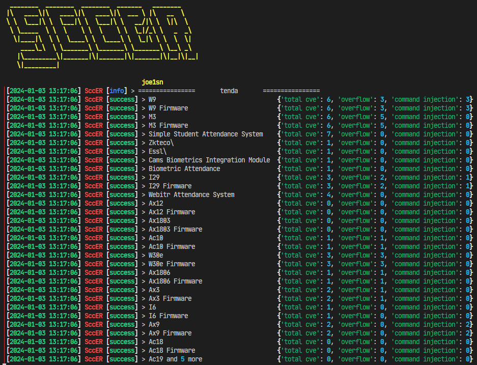

# route_fileter
统计路由器CVE，便于漏洞挖掘

使用：

```
python checker.py
```

在`checker.py`中指定要统计的路由器

```python
if __name__ == "__main__":
    banner()
    keywords = ["tenda","tp-link","mercury"]
    for word in keywords:
        cve_list = get_cve_json(word,1)
        result = {}
        page = 2
        while(stastic(result, cve_list)):
            # info(word, page)
            cve_list = get_cve_json(word,page)
            page+=1
        with open(word+".log","w") as f:
            f.write(str(result))
            f.write("\n")
        info("="*0x10," "*5,word," "*5,"="*0x10)
        for i in result:
            success(i.ljust(35," "), result[i])
```

